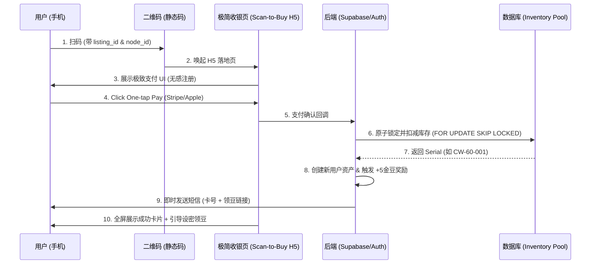

# 渥帮战略级框架：GigBridge (扫码即买/无人售卖) 全域方案

本文件为 **GigBridge** 框架的唯一权威文档，整合了产品愿景、市场策略、底层架构及技术落地细节。所有关于"扫码即买"场景的开发、设计与迭代均以此为准。

---

## 一、 产品愿景与战略定位 (Strategy & Vision)

**核心卖点：赋予物理空间数字化交互的能力。每一个贴在墙上的二维码，都是一个渥帮的入口。**

### 1. 核心定位
*   **Storefront Everywhere (处处皆店)**：将物理空间的任一平面（海报、密码箱、设备）转化为即时满足的数字店面。在需求的发生地，即刻满足。
*   **Zero-Friction Conversion (零摩擦转化)**：无需 App，利用"影子账户"与极简网页流，将支付前置。
*   **Low-Cost Vending (极轻量售卖)**：为商家取代昂贵的自动售货机，仅需一张二维码贴纸实现 24/7 无人售货。

### 2. 增长引擎 (Growth Logic)
*   **新用户转化钩子**：利用"新用户购买即送 5 金豆 (≈1元)"的获得感，在发放资产的瞬间将"游客"转化为"实名用户"。
*   **动态定价 (Dynamic Pricing)**：同一个物理码，白天原价，晚上可根据客流量或时段在后台动态调整价格，这是传统实体码无法实现的。

---

## 二、 现有系统集成 (Infrastructure Reuse)

GigBridge 深度复用渥帮现有成熟模块，确保资产与交易的一致性：

| 模块 | 对应现有表 | 复用逻辑 |
| :--- | :--- | :--- |
| **服务商** | `provider_profiles` | 商家作为 Provider 录入，管理其专属库存。 |
| **商品/SKU** | `listing_masters` / `items` | 售卖项（如洗车卡）作为 listing 录入，开启序列号模式。 |
| **用户体系** | `user_profiles` | 支持影子账号，支付成功后引导设置密码完成实名转化。 |
| **奖励系统** | `bean_transactions` | 奖励的金豆直接记入用户账本。 |
| **支付跟踪** | `orders` | 复用现有支付网关逻辑与状态跟踪。 |

---

## 三、 数据架构与技术细节 (Technical Architecture)

### 1. 核心数据模型

#### A. 商品元数据 (`listing_masters` 增强)
*   `is_serialized` (BOOLEAN): 标识该商品是否需要从库存池中提取唯一标识符。
*   `fulfillment_config` (JSONB): 取货引导模板、通知文案等。

#### B. 序列号资源池 (`listing_inventory`)
| 字段 | 说明 |
| :--- | :--- |
| `serial_number` | **核心标识**：卡号、激活码、或柜门号 (UNIQUE)。 |
| `secret_code` | **加密/隐私信息**：如开锁密码、动态 PIN。 |
| `status` | `available`, `sold`, `reserved`, `defective`, `expired`, `archived`。 |
| `metadata` | **万能扩展槽**：存放如 `{ "locker_pos": "A-12", "remaining_uses": 10 }`。 |

#### C. 资产使用流水 (`inventory_usage_logs`)
用于追踪"多次使用"或"余额类"资产，支持 `USE`, `RECHARGE`, `VOID` 等操作。

### 2. 技术护城河 (Technical Guardrails)
*   **原子化分配 (Atomic Allocation)**：宣称"百万并发无重号"。通过后端 `SELECT ... FOR UPDATE SKIP LOCKED` 技术，确保在高并发扫码时，数据库层面绝对不会重复发放。
*   **软删与溯源**：严禁物理删除资产。失效后状态变为 `archived`，确保财务对账和审计合规。

---

## 四、 核心业务逻辑与流程 (Core Logic & Data Flow)

### 1. 数据流图 (Data Flow)



### 2. 原子分配 SQL 代码参考
```sql
UPDATE listing_inventory 
SET status = 'sold', order_id = ?, buyer_id = ?, updated_at = NOW()
WHERE id = (
  SELECT id FROM public.listing_inventory 
  WHERE listing_item_id = ? AND status = 'available' 
  LIMIT 1 FOR UPDATE SKIP LOCKED
)
RETURNING serial_number, secret_code;
```

---

## 五、 入口与体验差异 (Entrance & UX)

| 特性 | **极简落地页 (Quick-Scan)** | **标准 Web 详情页 (Web Store)** |
| :--- | :--- | :--- |
| **场景** | 物理现场扫码 (如站立洗车房前) | 用户在平台内浏览、搜索 |
| **首要目标** | **支付转化率** (30秒内完成) | **信息完整度** (对比、评价、收藏) |
| **身份逻辑** | **影子账号优先** (先付后注册) | **登录账号优先** |
| **支付方式** | Apple/Google Pay (一键唤起) | Stripe Elements (列表选择) |

---

## 六、 场景兼容性集锦 (Extensibility)

*   **物理实体卡**：`serial_number` = 卡面号，`metadata` = 格子位。
*   **格口取货 (Locker)**：`serial_number` = 柜号，`secret_code` = 取货码。
*   **数字会员/授权码**：`serial_number` = 激活码，`valid_until` 限制期限。
*   **P2P 邻里路边摊 (Porch Pickup)**：无需分配 serial，支付触发卖家通知并标记 listing 为 SOLD。
*   **共享器材/空间**：扫码付押金/租金，`secret_code` 提供密码锁密码。

---

## 七、 演进路线 (Roadmap)

1.  **Phase 1 (MVP)** ✅：完成资产管理架构，实现洗车卡的手动导入与自动发码。
2.  **Phase 2 (Experience)** ✅：上线"注册领金豆"自动化奖励，优化影子账户逻辑。
3.  **Phase 3 (Scale)** ✅：开放商家端库存管理工具，支持全物理场景接入。

---

## 八、 实施现状 (Implementation Status)

> [!IMPORTANT]
> **更新时间**: 2026-01-24  
> **版本**: v1.0 Production-Ready

### ✅ 已完成核心功能 (Completed Features)

#### 1. 扫码购买全流程 (QR Checkout Flow)
- ✅ **快速购买模式**: 支持带 `?preselect=itemId` 参数的专属二维码
- ✅ **游客结账**: 无需注册，仅输入手机号即可完成支付
- ✅ **实时库存可见性**: 通过安全视图 `safe_inventory_levels` 查询库存
- ✅ **移动端优化**: 大字号、高对比度、精简协议勾选框

#### 2. 安全库存管理系统 (Secure Inventory Management)
- ✅ **商家管理面板**: 单条/批量录入库存，搜索与筛选
- ✅ **二维码批量打印**: 支持通用码和专属码两种模式
- ✅ **原子化库存分配**: PostgreSQL `FOR UPDATE SKIP LOCKED` 确保高并发安全

#### 3. 项目级安全架构 ("Secure Facade")
- ✅ **安全视图层**:
  - `safe_inventory_levels`: 只暴露库存状态，隐藏卡号密码
  - `public_user_info`: 只暴露公开信息，隐藏邮箱手机号
- ✅ **最小权限原则**: 原始表严格RLS + 视图公开查询
- ✅ **消除安全警告**: 符合 Supabase 最佳实践

#### 4. 智能补货通知系统 (Anti-Spam Alerts)
- ✅ **12小时冷却机制**: 防止商家被频繁通知骚扰
- ✅ **自动重置逻辑**: 添加库存后自动清空冷却标记
- ✅ **动态短信模板**: 从数据库读取可配置模板

#### 5. 支付成功凭证下发 (Post-Payment Fulfillment)
- ✅ **自动化履约**: Stripe Webhook → 库存分配 → 短信下发
- ✅ **错误容错**: 
  - 支付成功但库存不足时记录到 `failed_fulfillments` 表
  - 防止 Stripe 重试循环
- ✅ **成功页面优化**:
  - 显示实际商品名称（支持中英双语）
  - Done 按钮提供 window.close() 失败时的导航回退

#### 6. UI/UX 深度打磨
- ✅ 协议勾选框（14x14px 精致方块）
- ✅ 页面标题国际化（根据语言自动切换）
- ✅ 库存表格 Product 列 Tooltip 悬停显示
- ✅ 移动端适配（易点击、高对比度）

---

### 🔐 安全与合规成就 (Security Highlights)

| 特性 | 实现方式 | 状态 |
|------|---------|------|
| 数据隔离 | 敏感字段物理隔离在安全视图外 | ✅ |
| RLS 多层防护 | 原始表 + 视图双重权限控制 | ✅ |
| PCI 合规 | Stripe 处理支付，本地不存储卡信息 | ✅ |
| 最小权限 | 游客只能访问公开视图 | ✅ |
| 错误恢复 | failed_fulfillments 表追踪异常订单 | ✅ |

---

### 📊 生产环境验证 (Production Validation)

| 验证场景 | 结果 |
|---------|------|
| 游客扫码查看库存 | ✅ 正常 |
| 选择商品并输入手机号支付 | ✅ 正常 |
| 缺货时触发补货通知 | ✅ 正常（12h冷却生效） |
| 商家批量上传库存 | ✅ 正常 |
| 支付成功后短信下发凭证 | ✅ 正常 |
| 商家打印二维码 | ✅ 正常 |
| 支付成功但库存不足 | ✅ 记录到 failed_fulfillments |

---

### 🚀 待优化方向 (Future Optimizations)

根据优先级排序，详见 [roadmap_gigbridge_optimization.md](file:///C:/Users/hanzg/.gemini/antigravity/brain/e1a08a2e-1308-46cc-b9b4-c775e21caae5/roadmap_gigbridge_optimization.md)

#### 🔴 P0 - 生产必备
1. ~~错误处理与回退~~ ✅ **已完成**
2. **订单状态完整性**: 规范化状态追踪（UNPAID → PAID → FULFILLED）
3. **库存预警与自动下架**: 售罄后自动隐藏商品

#### 🟡 P1 - 重要优化
4. **用户体验增强**: 支付进度反馈、多语言优化（法语）
5. **监控与可观测性**: 实时库存告警、业务指标仪表板
6. **性能优化**: 图片CDN、查询索引、物化视图

#### 🟢 P2 - 锦上添花
7. **社交分享增强**: 生成推广海报
8. **会员积分系统**: JinBeans 积分抵扣
9. **智能推荐**: 基于购买历史的协同过滤

---

> [!IMPORTANT]
> **设计准则**：
> 1. 尽量减少用户点击次数，点击越少，钱进来得越快。
> 2. 每一个二维码都是一个潜在的"地推员"，必须保证落地页的加载速度和视觉溢价。
> 3. 安全永远是第一位的，但不能牺牲用户体验。通过"安全门面"架构实现平衡。
