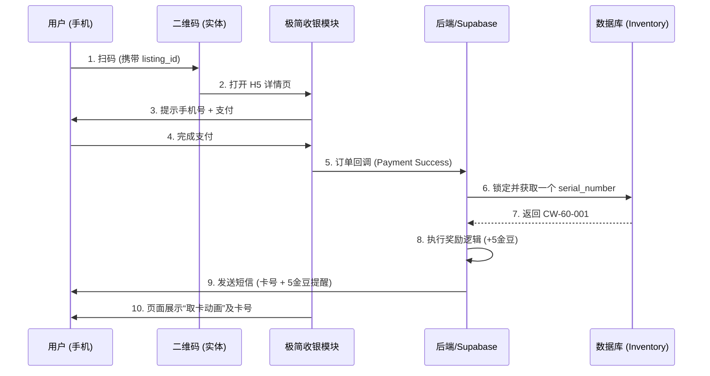

# 渥帮“轻量级无人售卖”落地技术方案 (MVP Phase)

为了快速实现洗车卡等“扫码即买”场景，我们需要在现有架构基础上增加 **1 个核心数据表** 和 **3 个公共模块**。

---

## 1. 新增公共数据模型 (Database)

### A. 物理资源池 `listing_inventory`
用于存放所有待分发的序列号（如洗车卡号）。这一张表即可支撑所有“分发类”业务。

| 字段名 | 类型 | 说明 |
| :--- | :--- | :--- |
| `id` | UUID | 主键 |
| `listing_id` | UUID | 关联 `listing_masters`，明确这是哪类卡的库存 |
| `serial_number` | TEXT | **核心数据**：物理卡卡号 (如 CW-60-001) |
| `status` | TEXT | 状态机：`available` (在库), `sold` (已售), `defective` (废卡) |
| `order_id` | UUID | 售出后关联 `orders` 表，方便溯源 |
| `assigned_at` | TIMESTAMP| 分配时间 |

### B. 商品表 `listing_masters` 增强
只需增加一个字段：
*   **`is_serialized` (BOOLEAN)**: 标识该商品是否需要从库存池中提取序列号。

---

## 2. 核心公共模块 (Shared Modules)

### A. 资产分配器 (`InventoryService`) —— 后端模块
*   **功能**：在支付回调成功后，自动锁定并选取一个 `available` 的序列号。
*   **处理逻辑**：
    ```sql
    -- 采用原子操作，确保不发重
    UPDATE listing_inventory 
    SET status = 'sold', order_id = ?, assigned_at = NOW()
    WHERE id = (
      SELECT id FROM listing_inventory 
      WHERE listing_id = ? AND status = 'available' 
      LIMIT 1 FOR UPDATE SKIP LOCKED
    )
    RETURNING serial_number;
    ```

### B. 极简H5收银台 (`QuickPayModule`) —— 前端模块
*   **功能**：针对扫码场景优化的购买页。
*   **处理流程**：
    1.  **静默登录**：系统检测本地无 Token，自动通过 `Supabase.auth.signInAnonymously()` 或记录手机号生成“影子账号”。
    2.  **快捷支付**：直接调用支付接口。

### C. 通知与奖励引擎 (`PostFulfillmentService`) —— 公共逻辑
*   **功能**：支付后的合并操作。
*   **处理逻辑**：
    1.  发送包含 `serial_number` 的短信。
    2.  判断是否为首次通过扫码购买：如果是，在 `user_profiles` 的 `beans_balance` 中额外 `+5`。

---

## 3. 数据处理全流程 (Data Flow)



---

## 4. 实施策略：如何“轻量级”

*   **第一步 (Data)**：直接在 Supabase 后台运行 SQL 创建 `listing_inventory` 表。
*   **第二步 (Fulfillment)**：编写一个 Supabase Edge Function (或现有的 Repository 扩展)，命名为 `handleCheckoutSuccess`。
*   **第三步 (UX)**：创建一个新的 Vue/React 路由 `/scan/:listingId`，专门作为扫码入口，页面逻辑压缩到极致，只求支付成功率。

---

> [!TIP]
> **落地意义**：
> 这一套模型一旦跑通，如果你以后想卖“社区影院门票”或“球场入场码”，你只需要往 `listing_inventory` 里导入一堆随机码就行了。所有购买、分配、通知逻辑全都是**公共**的。
